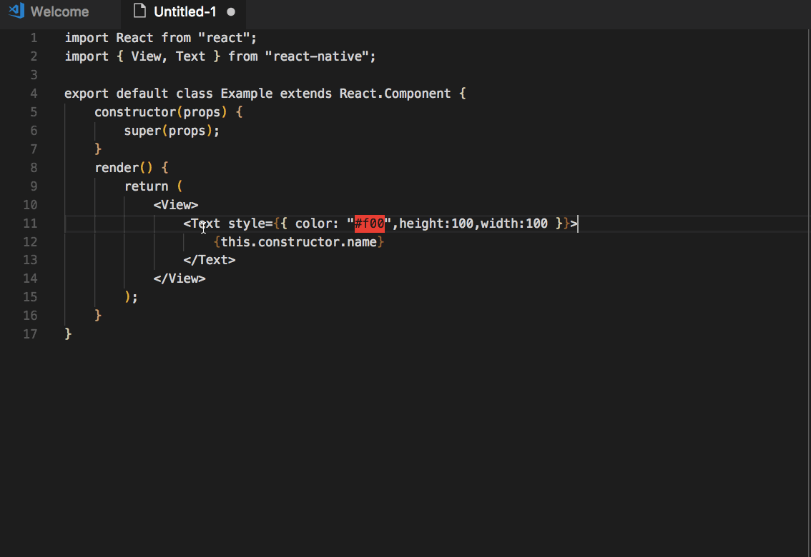

# vs-code stylesheetgetter



Separates inline styles from react native and generates a stylesheet constant

## USEAGE

Open your react native code and follow these steps :

Open the command palette
**macos**

`CMD`+`SHIFT`+`P` -> stylesheetget

**Windows/Linux**

`Ctrl` + `Shift` + `P` -> stylesheetget

Go to View → Command Palette

Type : stylesheetget

Then you will see all the inline styles seperated (each with a separate identifier) and a stylesheet constant.

## Example

## Source:

```
import React from "react";
import { View, Text } from "react-native";

export default class Example extends React.Component {
    constructor(props) {
        super(props);
    }
    render() {
        return (
            <View>
                <Text style={{ color: "#f00",height:100,width:100 }}>
                    {this.constructor.name}
                </Text>
            </View>
        );
    }
}
```

---

Run stylesheetgetter:

```
const styles = StyleSheet.create({
  a50c4fe704bc811e8862b451d80d9baf8: {
    color: "#f00",
    height: 100,
    width: 100
  }
});
import React from "react";
import { View, Text } from "react-native";

export default class Example extends React.Component {
  constructor(props) {
    super(props);
  }
  render() {
    return <View>
                <Text style={styles.a50c4fe704bc811e8862b451d80d9baf8}>
                    {this.constructor.name}
                </Text>
            </View>;
  }
}
```

Installation
In VS Code window:

**macos**

`CMD`+`SHIFT`+`X` -> stylesheetgetter

**Windows/Linux**

`Ctrl` + `Shift` + `X` -> stylesheetgetter

And click on install :)

If you want to save yourself from all the hassle of installing the plugin visit https://stylesheetget.now.sh/
